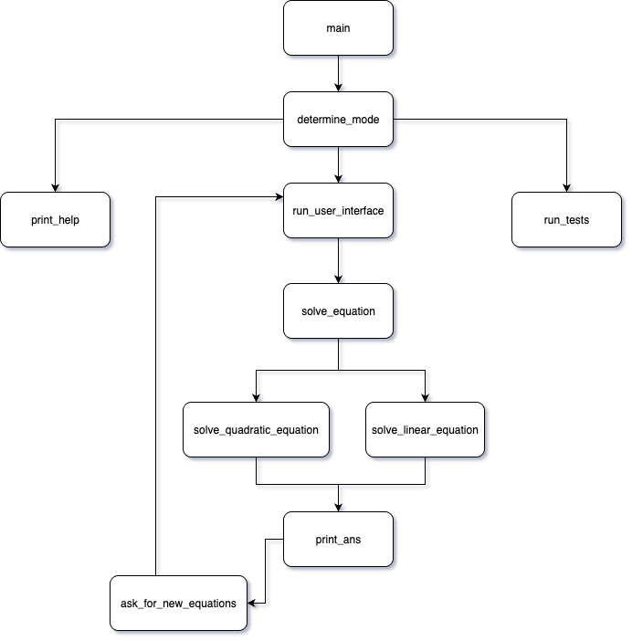

Quadratic equation solver
=========================
This program allow user to solve multiple quadratic equations.

Building the program
--------------------

To make a build use ```Makefile```. Run this code in terminal:

```
make
```

The builded version will be stored in ```solver``` file

Launching the program
---------------------

To launch the program you should enter in terminal:
```
./solver --your_launch_flag
```
*Note: replace ```--your_launch_flag``` with on of the launch flags presented below.*

**Launch flags** - information that shows in which mode you would like to launch the program.


You may launch the program in different modes by using these flags in the terminal:
|  Flag |                      Effect                     |
|:-----:|:-----------------------------------------------:|
| ```--user (-u)``` | launches program's user interface               |
| ```--test (-t)``` | launches unit-tests for program                 |
| ```--all (-a)```  | combines -user and -test flags (developer mode) |
| ```--help (-h)``` | provides information about launch flags         |

If you didn't enter any launch flags the ```--help``` flag will be used automatically.

User mode
---------

In user mode the program will ask you to enter coefficients of your equation.

Once you got the solutions for your equation the program will ask wether you have more equation. There are two options of answer is possible 0 or 1 which stands for quitting the program or continuing working with it respectively.

In any case if the input data is incorrect (for example you entered string value) it will provide you another chance to do it.

Unit-test mode
--------------

If you launched the program in unit-test mode it will run unit tests that are stored in ```tests.txt``` file.

The output will provide you the information about test result. There are two options of it:

| Message 	|                                            Meaning                                            	|
|:-------:	|:---------------------------------------------------------------------------------------------:	|
| ```OK```      	| the test is passed                                                                            	|
| ```FAILED```  	| program failed this unit-test and the testing information will be provided after this message 	|

*Note: if you decided to add your unit test, make sure you followed the general template and updated the number of tests value, presented in the first line of ```tests.txt``` file, as the program does not check correct input of unit_tests.*

Program Structure
-----------------

The diagram below shows the structure of the program:



Сalculation accuracy
--------------------

The quadratic equation solver uses ```double``` type variables to store equation coefficients. The accuracy provided by this program is $10^{-3}$. This standard deviation can be modified by changing value of ```EPSILON``` in ```solving_module.cpp```.


